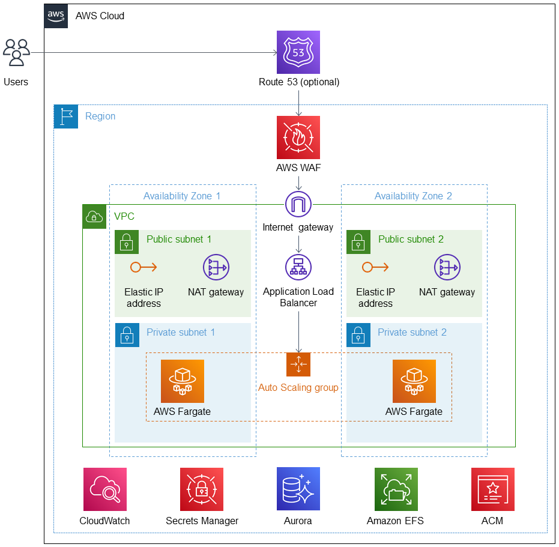

Deploying this Quick Start for a new virtual private cloud (VPC) with
*default parameters* builds the following _{partner-product-name}_ environment in the
AWS Cloud.

// Replace this example diagram with your own. Send us your source PowerPoint file. Be sure to follow our guidelines here : http://(we should include these points on our contributors giude)
:xrefstyle: short
[#architecture1]
.Quick Start architecture for _{partner-product-name}_ on AWS

As shown in <<architecture1>>, the Quick Start sets up the following:

* A highly available architecture that spans two/three Availability Zones.*
* A VPC configured with public and private subnets, according to AWS best practices, to provide you with your own virtual network on AWS.*
* An Amazon Route 53 record entry, if a hosted zone ID is entered during Quick Start deployment (optional).
* An Amazon Certificate Manager (ACM) public certificate for HTTPs connection (optional).
* An AWS Web Application Firewall using AWS Managed WAF rules for protection against SQL injection and common Wordpress exploits.
* An internet gateway to manage traffic into the VPC.
* In the public subnets:
** Elastic IP addresses ...
** Managed network address translation (NAT) gateways to allow outbound internet access for resources in the private subnets.*
* In the private subnets:
** WordPress running on Amazon Elastic Container Service (Amazon ECS) clusters on AWS Fargate, in an Amazon Elastic Compute Cloud (Amazon EC2) Auto Scaling group.
* An Application Load Balancer to distribute traffic among AWS Fargate instances in the Auto Scaling group.
* Amazon Aurora MySQL serverless database, managed by Amazon Relational Database Service (Amazon RDS), connected to containers on AWS Fargate.
* An Amazon EFS file system, to which containers on AWS Fargate are mounted, for storing Wordpress files, themes, and plugins.
* AWS Secrets Manager secret to store the RDS Aurora database password.

[.small]#* The template that deploys the Quick Start into an existing VPC skips the components marked by asterisks and prompts you for your existing VPC configuration.

